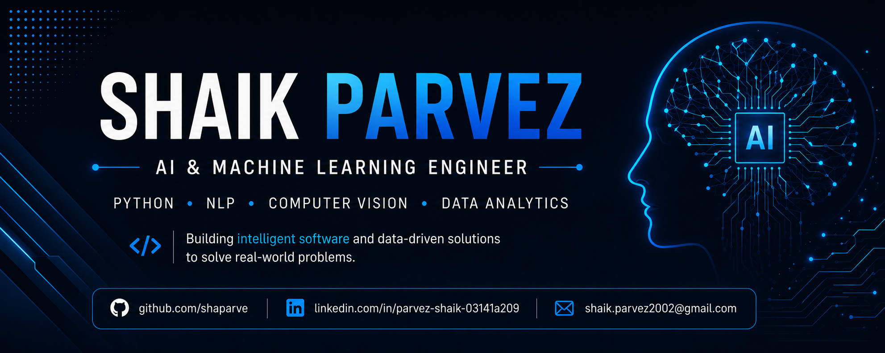

  

  

# 👋 Welcome to My GitHub

Building intelligent software with AI, Machine Learning, and Python to solve real-world problems.

I'm **Shaik Parvez**, an AI & Machine Learning Engineer with a passion for developing impactful solutions in **NLP, Computer Vision, Data Analytics, and Backend Development**.

## 🚀 About Me

- 🎓 Integrated M.Tech in Computer Science from **VIT Bhopal University** (2025)
- 🤖 Passionate about Artificial Intelligence, Machine Learning, NLP, and Computer Vision
- 💻 Experienced in developing AI/ML projects using **Python, TensorFlow, Scikit-learn, OpenCV, and SQL**
- 📊 Interested in Data Analytics, Backend Development, and AI-powered applications
- 🌱 Currently exploring **Large Language Models (LLMs), RAG, and Generative AI**
- 🎯 Open to opportunities as an **AI Engineer, ML Engineer, Data Analyst, or Software Engineer**

## 🛠️ Tech Stack

### 👨‍💻 Languages

  

### 🤖 AI / Machine Learning

  
  
  
  
  
  

### 🌐 Backend & Database

  

### 📊 Data Analytics & Visualization

  
  
  

### ⚙️ Tools

  
  
  

